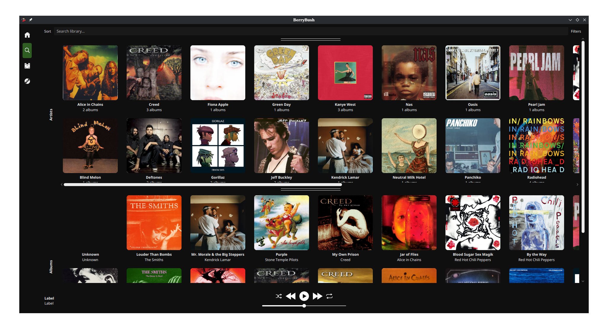

## Introduction:
Welcome to BerryBush.
The intention for this application is to be able to rip flac files from your cd collection and play them natively.

Please report bugs as you see them, I will fix them ASAP. Also let me know of any suggestions, I am open to anything!

## Instructions:
1. Set up a directory
2. Run the app and select your base directory and username. You can change it later in the settings. If at any time the userdata is messed up, it will prompt you to pick a new directory and username.
3. Playlists (Needs to be reimplemented)!
   1. You can make playlists with the plus button in the explorer. 
   2. Images can be added under resources/graphics/playlist-art/name-of-playlist.png Art will automatically be added when refreshing the explorer.
   3. To add a song, select the menu button next to a song in the preview tab and go to Playlists > Your Playlist Name

### FIXES BEFORE V1.0:
- [ ] Polish volume control (Threading)
- [ ] Fix UI resizing
- [ ] Playlist art
- [ ] Reimplement features lost during gui redo
- [ ] Multiple discs is unsupported

### ROADMAP
- [ ] Color pick-able UI
- [ ] Musicbrainz integration
- [ ] Show songs in queue
- [ ] Built in CD-ripper
- [ ] Edit file tagging (change image, name, artist, etc)
- [ ] Home page
- [ ] Change background picture
- [ ] Artist pages
- [ ] Playback speed
- [ ] Support for other file types
- [ ] Listening stats
- [ ] Highlight active parent in treeview

### Completed  ✓
- [x] Shuffling
- [x] Tracks aren't ordered correctly
- [x] Artist images
- [x] Consolidate CSS theming
- [x] Fix the window
- [x] Search feature
- [x] Setup wizard
- [x] Playlists
- [x] Switch to TOML data storage
- [x] Fix MPRIS
- [x] Add sorting for treeview
- [x] Migrate to Log4j
- [x] Fix playlists
- [x] Switching to open tabs has become broken
- [x] Gapless playback
- [x] Scrollbar retains position after refreshing songlist

## Credits:
- I am using some Icon8 icons for my buttons, they're great.

